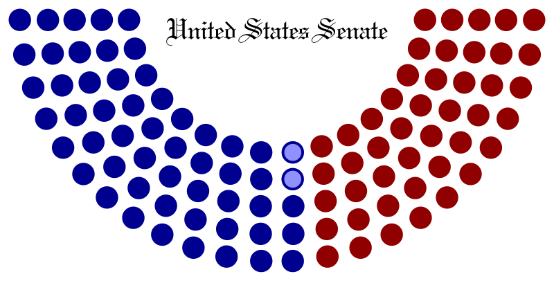
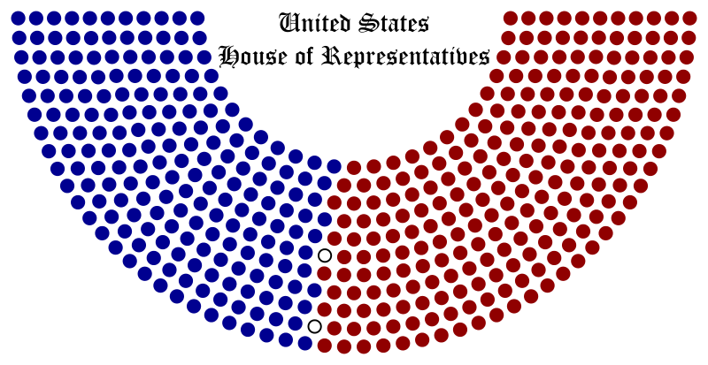
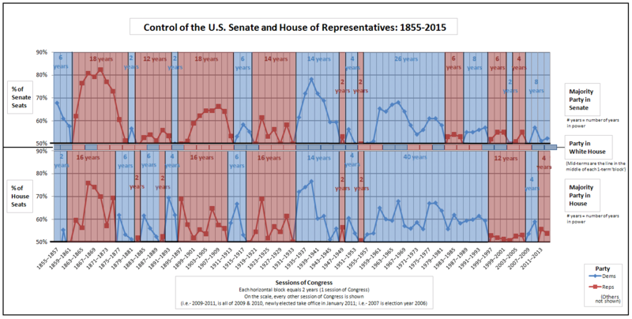
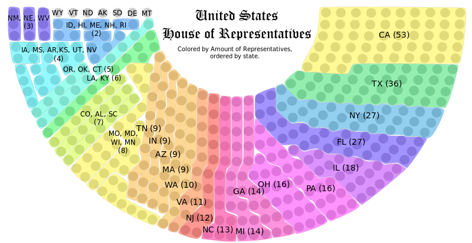
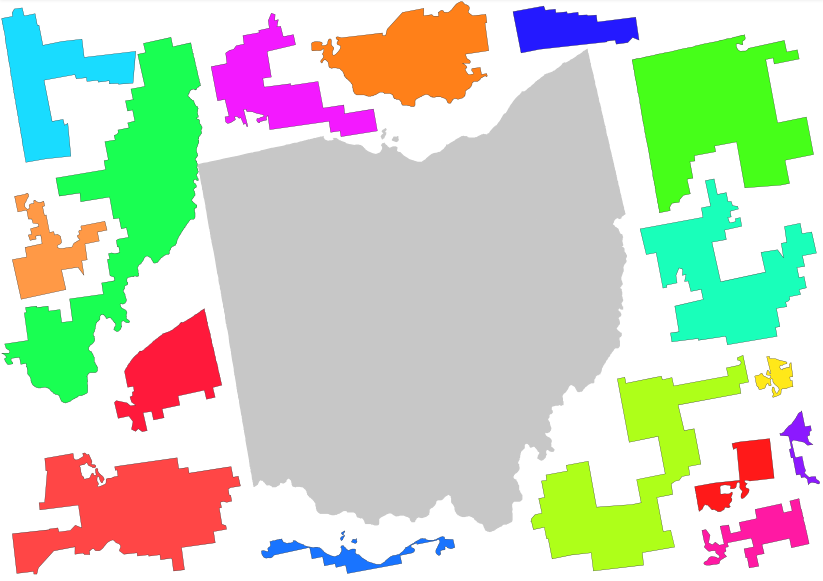
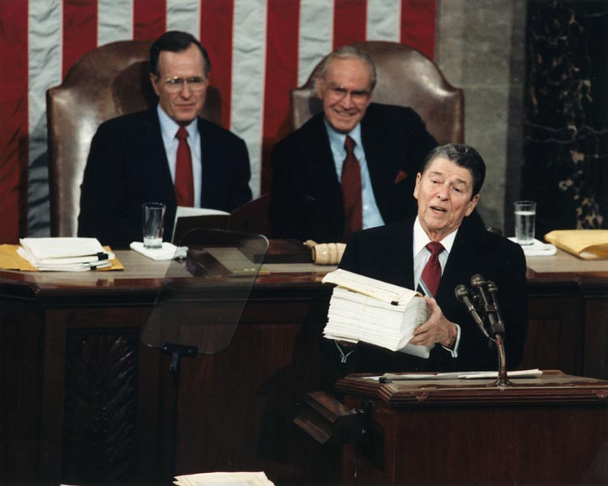

layout: true

---

class: center, middle, inverse, full-text

# Senate & House of Representatives

강철 (Cheol Kang)

---

# Index

1. Overview
1. History
1. Composition
1. Interesting Features
1. Summary

---

class: middle

## Senate + House of Representatives = <b>US Congress</b>

<i>Bicameralism</i>: a legislative system w/ two separate assemblies

---

# US Congress

.list-line-height[
**Legislative branch** of US Gov. 
The composition and powers are established in _Article I_ of the _US Constitution_. 
The major power is to pass federal legislation that affects the entire country.
]

### Senate <small>(상원)</small>

- **Represent the states**
- 2 senators / state (regardless of their population)
- Considered to be more deliberative/prestigious

### House of Representatives <small>(하원)</small>

- **Represent the people** of each state
- \# of representatives - based on the population

---

# Comparision

<table style="margin-top: 30px;">
    <tr>
        <th></th>
        <th> Senate</th>
        <th> House</th>
        <th> Korean NA</th>
    </tr>
    <tr>
        <th>term</th>
        <td style="width: 30%;">
6 years <small>(staggered)</small>
</td>
        <td style="width: 30%;">
2 years
</td>
        <td style="width: 30%;">
4 years
</td>
    </tr>
    <tr>
        <th>seats</th>
        <td>
100
</td>
        <td>
435
</td>
        <td>
300
</td>
    </tr>
    <tr>
        <th>seats per state</th>
        <td>
2
</td>
        <td>
1 ~ 53(CA)
</td>
        <td>
1 ~ 51(경기)
</td>
    </tr>
    <tr>
        <th>exclusive power</th>
        <td><ul style="margin-top: 0;">
            <li>treaty
            <li>confirming Cabinet secretaries
        </ul></td>
        <td><ul style="margin-top: 0;">
            <li>taxation
            <li>revenue / appropriation bills
        </ul></td>
        <td>
N/A
</td>
    </tr>
</table>

.pull-right.font-80[※ Korean NA is <i>unicameral</i> since 1963]

---

class: middle, center, inverse

# History

---

# History of Bicameralism in US

**[1774]**  **The 1st Continental Congress**: a convention of delegates from 12 colonies.

**[1776]**  **The 2nd Continental Congress** adopted the **Declaration of Independence**.

**[1781]**  Started with the **unicameral** body with equal representation among the states.

**[1787,1789]**  Governement powerless led to the revised constitution which proposed a **bicameral** congress. The **1st United State Congress** started.

**[1913]**  _17th Amendment_: Direct election of senators by **popular election**. 
\- Before that, senators were elected by the state legislatures.

**[2014] (Present)**  The **113th United State Congress**: from 2013 to 2014.

---

class: middle, center, inverse

# Composition

---

# Composition

### .center[**535** <small>seats</small>]

.center[

     
    <b>Senate</b> 
    <small>100 seats</small>

+

     
    <b>House</b> 
    <small>435 seats</small>

]

.right[

&nbsp;

.red[■:&nbsp;&nbsp;republican] 
.blue[■:&nbsp;democratic]
]

---

# Composition

Majority party of each chamber changes over time. 
There were significant events that triggered power shift: 
&nbsp;&nbsp;&nbsp;&nbsp;_American Civil War <small>(1861-1865)</small>_ & _Great Depression <small>(1930-1940s)</small>_

---

# Composition

---

class: middle, center, inverse

# Random Interesting Features

---

# Gerrymandering

.center[

]

- Gerry + Salamander
- Manipulating district boundaries to create partisan advantaged districts
- [Gerrymandering Jigsaw Game](http://www.slate.com/articles/news_and_politics/map_of_the_week/2013/08/gerrymandering_jigsaw_puzzle_game_put_the_congressional_districts_back_together.html)

---

# Filibuster

.center[.small-image[]]

Original meaning: _"pirate, robber"_

A tactic used to defeat bills and motions by prolonging debate indefinitely: 
\- One or more members can speak as long as they wish to delay, or entirely prevent a vote.

---

class: middle, center, inverse

# Summary

---

# Summary

.font-120[
- Senate + House of Representatives = US Congress
- Role of congress: **legislation** (= propose & pass bills)
- **Senate** represents states, **house** represents people.
    - Senator: 2 seats / state
    - Representatives: 1~53 seats / state
- The term of each congress: **2 years**.
    - 1/3 senators & 100% representatives are newly elected.
    - Current assembly: 113th (2013-2014)
]

---

class: center, middle, inverse, full-text

# Thank You!

Cheol Kang
